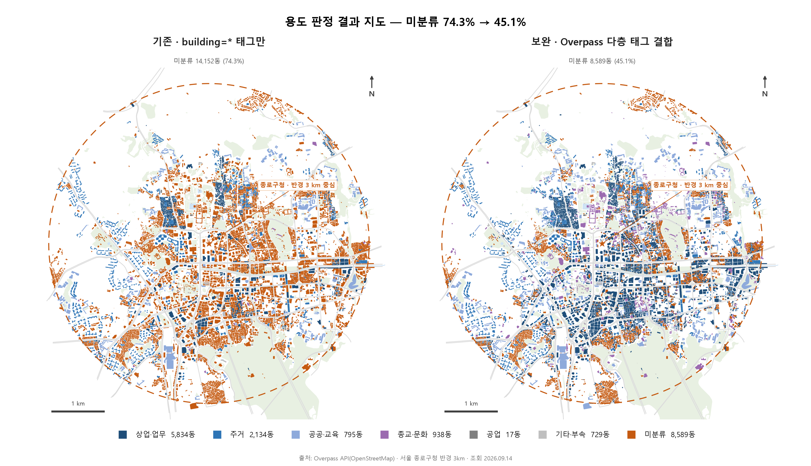
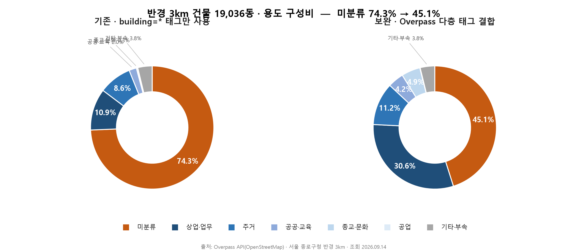
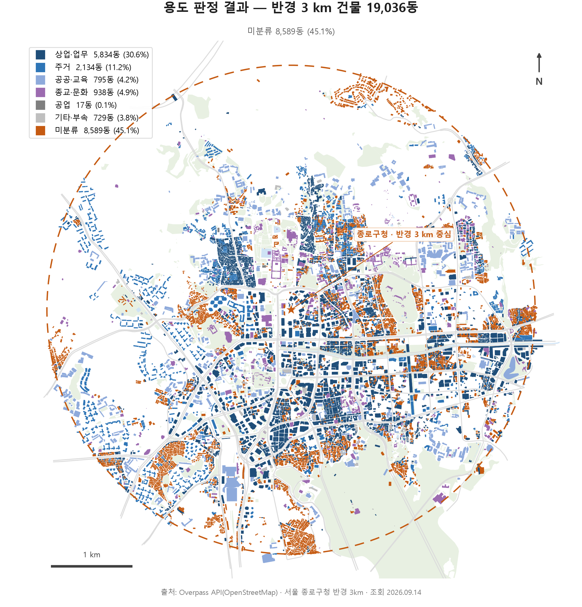
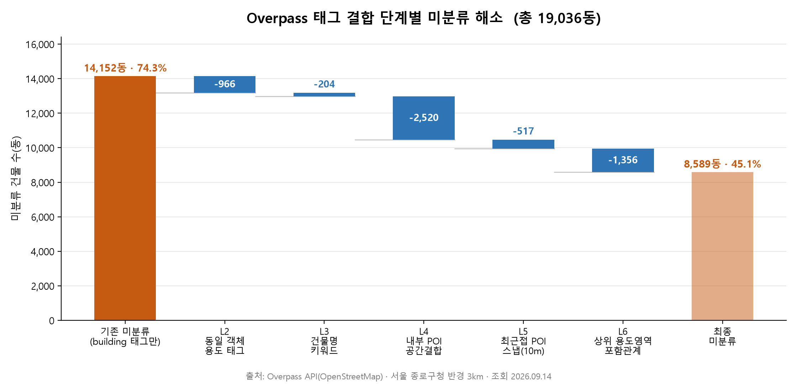

# 종로 반경 3 km 건물밀도 판독

### ▶ [**대시보드 열기**](https://choemyeongwon1-ui.github.io/kaya/) ◀

<sub>GitHub Pages 주소입니다. Vercel 배포 주소는 아래 [배포](#배포) 참고.</sub>

반경을 움직이며 원 안의 건물만으로 밀도·용도·판정근거를 다시 계산하는 화면입니다.
위성/OpenStreetMap 배경 전환, 건물에 올리면 판정근거 표시.

> **저장소의 `.html` 파일을 클릭하면 코드만 보입니다.** GitHub은 HTML을 실행하지 않기 때문입니다.
> 실행 화면은 위 링크로 들어가세요. 아래는 그 결과를 이미지로 미리 본 것입니다.

**대상** 서울 종로구청(37.5735, 126.9790) 반경 3 km · 건물 **19,036동**
**출처** Overpass API (OpenStreetMap) · 조회 2026-09-14
*(슬라이드의 19,282동과 246동 차이는 2026-08-26 이후 OSM 편집 반영분입니다.)*

---

## 한눈에 보기

`building` 태그 하나만 읽던 방식(왼쪽)과 근거 6단계를 결합한 방식(오른쪽).
주황이 미분류이고, **78% → 45%로 줄었습니다.**





남은 미분류(주황)가 고르게 흩어져 있지 않고 **북촌·서촌·부암동 이면 주거 골목에 몰립니다.**
간선축은 거의 다 판정되므로, 누락이 무작위가 아니라 공간적으로 편향돼 있다는 뜻입니다.



단계별로 미분류가 얼마나 풀렸는지:



---

## 1. 문제

슬라이드 28p의 도넛은 `building=*` **태그 값 하나만** 보고 용도를 나눴습니다.
OSM에서 `building=yes`는 "여기 건물이 있다"는 뜻일 뿐 용도가 아니므로,
19,036동 중 **14,152동(74.3%)** 이 미분류로 떨어집니다.
여기에 `building=garage/roof/shed` 같은 부속건물 719동(3.8%)까지 묶으면
**78.1%** — 슬라이드의 78.3%와 사실상 같은 값입니다.

**하지만 용도 정보 자체는 OSM 안에 있습니다.** 건물 폴리곤이 아니라
그 안의 POI 노드, 건물 이름, 상위 용도영역 폴리곤에 흩어져 있을 뿐입니다.
이걸 전부 Overpass로 같이 끌어와 공간결합하면 미분류가 크게 줄어듭니다.

## 2. 방법 — 6단계 근거 워터폴

건물 한 동마다 아래 순서로 근거를 찾고, **가장 먼저 맞은 단계에서 확정**합니다.
(위쪽이 근거가 강함 → 아래로 갈수록 약함)

| 단계 | 근거 | 해소 | 예시 |
|---|---|---|---|
| L1 | `building=*` 값 자체 | 4,884동 | `building=apartments` → 주거 |
| L2 | **같은 객체**에 붙은 용도 태그 | 966동 | `building=yes` + `amenity=cafe` → 상업·업무 |
| L3 | 건물명 한글 키워드 | 204동 | 이름에 "교회/초등학교/빌딩/아파트" |
| L4 | **건물 내부 POI 공간결합** (point-in-polygon) | 2,520동 | 폴리곤 안에 `shop=*` 노드 3개 → 상업·업무 |
| L5 | 최근접 POI 스냅 (≤10 m) | 517동 | 주소점이 외곽선 밖 6 m에 찍힌 경우 |
| L6 | 상위 용도영역 포함관계 | 1,356동 | `landuse=residential`, `historic=castle`(창덕궁) 안 |
| — | 근거 없음 → 미분류 | 8,589동 | |

- L4에서 POI가 여러 개면 **다수결**, 동수면 상업 > 공공 > 종교 > 공업 > 주거 순.
- L6은 용도를 실제로 함의하는 폴리곤만 화이트리스트로 인정했습니다.
  `leisure=park`, `tourism=attraction` 같은 폴리곤은 **의도적으로 제외** —
  청계천공원 안에 있다고 그 건물이 문화시설이 되지는 않기 때문입니다.
- 사용한 POI 13,195개 중 8,631개는 건물 내부, 1,237개는 10 m 이내 스냅,
  3,327개는 대응 건물이 없어 버렸습니다.

## 3. 결과

| 용도 | 기존(building 태그만) | | 보완(다층 결합) | |
|---|---:|---:|---:|---:|
| **미분류** | **14,152동** | **74.3%** | **8,589동** | **45.1%** |
| 상업·업무 | 2,082동 | 10.9% | 5,834동 | 30.6% |
| 주거 | 1,642동 | 8.6% | 2,134동 | 11.2% |
| 공공·교육 | 373동 | 2.0% | 795동 | 4.2% |
| 종교·문화 | 58동 | 0.3% | 938동 | 4.9% |
| 공업 | 10동 | 0.1% | 17동 | 0.1% |
| 기타·부속 | 719동 | 3.8% | 729동 | 3.8% |

**미분류 74.3% → 45.1% (5,563동 해소, 기존 미분류의 39.3%)**

미분류를 뺀 "확인된 건물"만으로 구성비를 다시 잡으면:

| | 기존(n=4,884) | 보완(n=10,447) |
|---|---:|---:|
| 상업·업무 | 42.6% | **55.8%** |
| 주거 | 33.6% | 20.4% |
| 공공·교육 | 7.6% | 7.6% |
| 종교·문화 | 1.2% | 9.0% |

→ 슬라이드의 "상업·업무가 주거보다 많다"는 해석은 **유지되고, 오히려 강해집니다**
(1.27배 → 2.73배). 표본이 2.1배로 늘어난 상태에서도 방향이 같으므로
"도심이라는 사전지식과 우연히 맞은 것"이라는 원래 우려는 상당 부분 해소됩니다.

## 4. 남은 한계 (슬라이드에 그대로 쓸 수 있는 문장)

1. **45.1%는 여전히 미분류.** 8,589동은 OSM 안에 어떤 용도 근거도 없습니다.
   OSM은 자원봉사 매핑이라 커버리지가 고르지 않다는 슬라이드의 지적은 유효하며,
   이번 작업은 그 격차를 **78% → 45%로 정량화**한 것입니다.
2. **혼합용도 과소표현.** 1층 근생 + 상층 주거인 종로 일대 건물은 POI가 상업만
   잡히므로 상업·업무로 판정됩니다. 상업 비중은 상한값으로 읽어야 합니다.
3. **POI 밀도 편향.** 관광·상업지에 POI가 집중되어 L4·L5가 상업 쪽으로 기웁니다.
   북촌·서촌 주거 골목은 여전히 미분류로 남습니다.
4. 따라서 **건축물대장·도시계획현황 교차검증이 여전히 필요**합니다.
   다만 대상이 19,282동 전수가 아니라 **남은 8,589동**으로 줄었습니다.

## 5. 산출물

```
out/buildings_classified.csv   19,036동 전수 (좌표·용도·판정단계·판정근거)
out/summary.json               집계 결과

[차트]
out/donut_before.png           기존 도넛 (슬라이드 28p 재현)
out/donut_after.png            보완 도넛
out/donut_before_after.png     전·후 비교 2패널
out/waterfall.png              단계별 미분류 해소 폭포 차트

[지도]
out/map_buildings.png          수집 결과 지도 — 건물 19,036동 전수를 파란색으로 표시
out/map_use.png                용도 판정 결과 지도 (용도별 색상)
out/map_before_after.png       전·후 비교 지도 2패널
```

지도는 OSM 건물 폴리곤을 실제 좌표대로 그린 것이며(등장방형 투영, 1 km 스케일바),
수계·녹지·간선도로를 배경으로 함께 받아 위치를 알아볼 수 있게 했습니다.
`map_buildings.png`의 **파란색 = Overpass가 반환한 건물 폴리곤 전수**이므로
"이 19,036동이 모집단"이라는 슬라이드 문장을 그림으로 바로 뒷받침합니다.

지도에서 바로 읽히는 패턴 두 가지:

- **미분류(주황)가 북촌·서촌·부암동·성북 방면 주거 골목에 집중**됩니다.
  종로·을지로 간선축은 거의 다 판정되는 반면 이면도로 저층 주거지가 비어 있어,
  남은 45.1%가 무작위 누락이 아니라 **공간적으로 편향된 누락**임이 보입니다.
- 상업·업무(남색)가 종로·청계천·을지로 축을 따라 선형으로 늘어서고,
  종교·문화(보라)는 경복궁·창덕궁·종묘 일대에 뭉칩니다. 태그 결합 결과가
  실제 도심 구조와 일치한다는 점이 분류의 타당성 근거가 됩니다.

`buildings_classified.csv`의 `판정근거` 열에 건물마다 어떤 태그·POI로 판정했는지
그대로 남겨 두었으므로 발표 중 질문이 들어와도 개별 건물 단위로 추적 가능합니다.

## 6. 재현 방법

```bash
py scripts/fetch.py       # Overpass에서 건물/POI/용도영역/배경 원본 수집 (raw/에 캐시)
py scripts/classify.py    # 6단계 워터폴 분류 -> out/
py scripts/chart.py       # 도넛·폭포 차트 렌더링 -> out/
py scripts/map.py         # 지도 3종 렌더링 -> out/
```

의존성은 차트용 `matplotlib` 하나뿐이며, 수집·공간연산은 모두 표준 라이브러리입니다
(ray-casting point-in-polygon + 격자 인덱스 자체 구현).
분류 규칙은 `scripts/taxonomy.py`(태그→용도 매핑)와 `scripts/names.py`(건물명 키워드)
두 파일에만 있으므로 기준을 바꾸려면 이 둘만 수정하면 됩니다.

## 7. 대시보드

```
바탕화면/종로_건물밀도_대시보드.html   ← 그냥 이걸 더블클릭하면 됩니다 (7 MB, 전부 내장)

dashboard/index.html                  위와 같은 단독 실행본
dashboard/dashboard_standalone.html   위와 같은 단독 실행본
dashboard/index_server.html           서버/아티팩트용 경량본 (40 KB, data/를 fetch)
dashboard/data/*.json|jpg             건물 19,036동 · 배경지도 · 위성 이미지
scripts/export_web.py                 out/ 결과 -> 대시보드용 압축 JSON
scripts/satellite.py                  Esri World Imagery 타일 수집·합성
scripts/bundle.py                     index_server.html + data -> 단독 실행본
```

### 로컬에서 열 때

**`dashboard` 폴더 안의 HTML은 전부 더블클릭으로 열립니다.** 데이터와 위성 이미지가
파일 안에 들어 있어 서버가 필요 없고, 인터넷이 끊겨도 동작합니다.

처음 열 때 파일이 7 MB라 몇 초 걸립니다. 그동안 지도 자리에 "건물 19,036동을 그리는 중…"이
표시되므로, 빈 화면으로 보이지 않습니다.

`index_server.html`만 예외로 서버가 필요합니다. `file://`로 직접 열면 브라우저가 보안
정책(CORS)상 `data/` 폴더 읽기를 막기 때문이며, 그 경우 화면에 안내가 뜹니다. 서버로 보려면:

```bash
py -m http.server 8000
```

데이터를 다시 뽑은 뒤에는 `py scripts/bundle.py` 로 단독 실행본을 갱신하세요.

퍼블리시 주소: https://claude.ai/code/artifact/2f323202-897d-4d52-80e5-979f115859a8

구성: 상단 KPI 4개(원 안 건물수·**밀도**·미분류·상업÷주거) → **반경별 건물밀도 지도**
→ INSIGHT 3항목 → 한계 4항목.
밀도 동심원(파이)과 판정근거 막대그래프는 별도 카드가 아니라 **지도 안 인셋**입니다 —
파이는 우상단, 막대는 우하단이며 지도 조작을 막지 않도록 클릭이 통과합니다.

### 반경 슬라이더 (0.3 ~ 3.0 km)

반경을 움직이면 **원 안에 중심점이 들어오는 건물만으로** 모든 수치가 다시 계산됩니다 —
건물 수, 밀도, 거리대별 밀도, 용도별 동수, 판정근거 단계별 해소량까지 전부.
원 밖 건물은 회색 맥락으로 남고, 지도에는 거리대 링이 점선으로 표시됩니다.

반경에 따른 값 변화(보완 기준):

| 반경 | 건물 | 밀도(동/km²) | 미분류 | 상업÷주거 |
|---:|---:|---:|---:|---:|
| 3.0 km | 18,900동 | 668 | 45.1% | 2.78배 |
| 1.0 km | 3,959동 | 1,260 (×1.89) | 28.7% | 6.10배 |
| 0.5 km | 555동 | 707 | 39.1% | 30.0배 |

읽을 거리 두 가지:
- **밀도 정점은 중심이 아니라 0.5–1.0 km 링**(1,445 동/km²)입니다. 중심 500 m는 경복궁·청와대
  부지라 오히려 낮고(707), 바깥 링은 북악·남산이 총면적을 키워 낮아집니다.
- **반경을 줄이면 미분류가 45.1% → 28.7%로 떨어집니다.** OSM 기재가 도심 코어일수록 촘촘하다는
  뜻이며, 슬라이드의 "자원봉사 매핑이라 커버리지가 고르지 않다"는 지적을 수치로 보여 줍니다.

### 배경 토글 — 위성사진(기본) / OpenStreetMap

- *위성사진* — **기본값.** Esri World Imagery(z16) 타일 196장을 미리 받아 3584×3584 JPEG
  한 장으로 합쳐 동봉했습니다. 퍼블리시된 아티팩트는 CSP상 외부 타일 서버에 접근할 수 없어
  실시간 타일을 쓸 수 없기 때문입니다. 위성은 Web Mercator, 지도 좌표계는 지역 등장방형이라
  **위도 24개 스트립으로 나눠 그려** 오차를 1 m 미만으로 눌렀습니다.
- *OpenStreetMap* — OSM 카토 스타일(베이지 지면, 흰 도로 + 케이싱, 연녹 녹지, 하늘색 수계)을
  같은 Overpass 조회 벡터로 직접 그렸습니다.

OSM 배경은 **항상 아래에 깔립니다.** 위성 이미지는 정사각형이라 지도 폭이 넓으면 좌우에 빈
영역이 생기는데, 그 자리에 OSM 도로·녹지가 이어지도록 하기 위해서입니다.

**기존 / 보완 토글**은 그대로입니다. 지도·인셋·KPI가 한꺼번에 같은 기준으로 바뀝니다.

**배경 위성 / 지도 토글**:
- *위성* — Esri World Imagery(z16) 타일 196장을 미리 받아 3584×3584 JPEG 한 장으로 합쳐
  페이지에 동봉했습니다. 퍼블리시된 아티팩트는 CSP상 외부 타일 서버에 접근할 수 없어
  실시간 타일을 쓸 수 없기 때문입니다. 위성은 Web Mercator, 지도 좌표계는 지역 등장방형이라
  **위도 24개 스트립으로 나눠 그려** 오차를 1 m 미만으로 눌렀습니다.
  건물 폴리곤은 α 0.86으로 얹어 아래 영상이 비치게 했습니다.
- *지도* — 같은 Overpass 조회에서 받은 OSM 벡터(녹지·수계·도로·철도).

건물 좌표는 중심 기준 0.5 m 단위 정수로 델타 인코딩해 19,036동을 1.9 MB에 담았습니다.
건물에 마우스를 올리면 `판정근거`가 그대로 나오므로 발표 중 개별 건물 질문에 대응됩니다.
범례를 눌러 용도별로 끄고 켤 수 있어, 미분류만 남겨 누락의 공간 편향을 보여 주기 좋습니다.

`py scripts/satellite.py` 로 위성 배경을 다시 받을 수 있습니다(`pillow` 필요).
위성 이미지 저작권 표기는 지도 하단에 `© Esri, Maxar, Earthstar Geographics`로 넣었습니다.

## 배포

정적 파일만 있는 저장소라 빌드 과정이 없습니다. 두 곳 모두 `main` 브랜치에 푸시하면
자동으로 갱신됩니다.

| 호스팅 | 주소 | 상태 |
|---|---|---|
| GitHub Pages | https://choemyeongwon1-ui.github.io/kaya/ | 사용 중 · 2026-09-20 21:19 KST 200 확인 |
| Vercel | (배포 후 기입) | 준비됨 |

### Vercel 연결하기

1. https://vercel.com 접속 → **Continue with GitHub** 으로 로그인
2. **Add New… → Project**
3. `kaya` 옆 **Import**
   - 목록에 없으면 **Adjust GitHub App Permissions** 에서 이 저장소 접근을 허용
4. 설정은 **건드리지 않고** 그대로 **Deploy**
   - Framework Preset `Other`, Build Command 비움, Output Directory `.` 가 맞습니다
   - 빌드가 없으므로 1분 안에 끝납니다
5. 나온 `*.vercel.app` 주소가 배포 주소입니다

`vercel.json` 은 `dashboard/data/` 의 대용량 파일(위성 이미지 3.6 MB, 건물 1.9 MB)에
장기 캐시 헤더를 붙입니다. 두 번째 방문부터 즉시 뜹니다.
